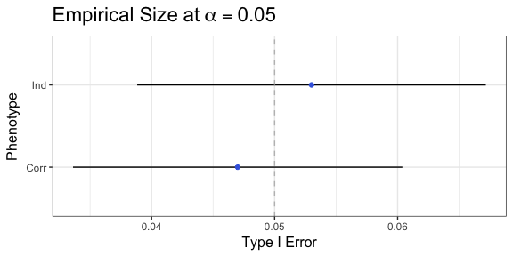
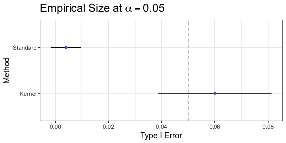

# README
Zachary McCaw  
12/15/17  

# Package Vignette


## Contents

* [Standard Score Test](#standard-score-test)
* [Kernelized Score Test](#kernelized-score-test)

## Standard Score Test
Consider the linear model:

$$
y = X\alpha + G\beta+\epsilon
$$
Here $\epsilon \sim N(0,\tau R)$, where $\tau$ is a variance component and $R$ is a fixed correlation structure. Suppose $\beta$ is the regression parameter of interest, $\alpha$ is a nuisance regression parameter. Define the error projection matrix:

$$
Q = \tau^{-1}(R^{-1}-R^{-1}X(X'R^{-1}X)^{-1}X'R^{-1})
$$

The function `NormScore` provides a score test of $H_{0}:\beta = 0$. In particular, the score statistic is calculated as:
$$
T_{S} = yQG(G'QG)^{-1}G'Qy
$$
A $p$-value for $T_{S}$ is estimated by comparison with the $\chi_{\dim(\beta)}^{2}$ distribution. 

#### Sample Data
Data including covariates $X$, genotypes $G$, and phenotype $Y$ were simulated for $10^{3}$ subjects. Covariates include age, sex, and the first two principal components of the centered and scaled subject by locus genotype matrix. Genotypes were generated at $10^{3}$ loci on chromosome one. Two (idependent) phenotypes were simulated based on the linear predictor. `Y.ind` was obtained by adding $N(0,1)$ residuals to each observation, while `Y.corr` was obtained by adding residuals that exhibit an exchangeable correlation structure with $\rho = 0.2$. 

#### Size simulations
In the following, the genotype matrix is centered and scaled, then the score test is applied individually to each locus in $G$. Size is estimated at $\alpha = 0.05$ by averaging an indicator of rejection. 


```r
# Phenotype matrix
Y = NormalScoreTest::Y;
n = nrow(Y);
# Covariate matrix
X = NormalScoreTest::X;
# Genotype matrix
G = NormalScoreTest::G;
# Standardizing genotype matrix
Gs = scale(t(G));
# Score test for independent phenotype
Results.ind = NormalScoreTest::rNormScore(G=Gs,X=X,y=Y[,1]);
# Exchangeable correlation structure
R = NormalScoreTest::exchCorr(n=n,r=0.2);
Results.corr = NormalScoreTest::rNormScore(G=Gs,X=X,y=Y[,2],R=R);
```



## Kernelized Score Test
The kernelized score test is calculated as:

$$
T_{K} = y'QLL'Qy
$$

Here $L = GW$, where $W$ is a digonal, positive definite weight matrix. A $p$-value for $T_{K}$ is estimated by comparison with the mixture distribution:

$$
\sum_{\{k:\lambda_{k}\neq 0\}}\lambda_{k}\chi_{1}^{2}(0)
$$

Here $\lambda_{k}$ are the non-zero eigen-values of $L'QL$. 

#### Size Estimation
For $R=5\times10^{2}$ MC replicates, groups of $10$ distinct loci were drawn at random from the centered genotype matrix. A kernelized score test of $H_{0}:\beta_{1}=\cdots=\beta_{10}=0$ was conducted, where $L = GW$, and the weighting scheme proposed in `SKAT` was adopted. For comparison, the standard score test of this hypothesis was also assessed. Size is estimated at $\alpha = 0.05$ by averaging an indicator of rejection.


```r
library(doMC);
library(foreach);
doMC::registerDoMC(cores=4);
R = 5e2;
# Pre-calculate minor allele frequencies
maf = apply(G,MARGIN=2,FUN=mean)/2;
# Use independent phenotype
y = Y[,1];
# Down sample subjects
P = foreach(r=1:R,.combine=rbind,.inorder=F) %do% {
  # Select 10 loci at random
  Draw = sort(sample(ncol(Gs),size=10,replace=F));
  # Subset genotypes
  Gsub = Gs[,Draw];
  # Standard score test
  p = NormalScoreTest::NormScore(G=Gsub,X=X,y=y)["p"];
  # Weights
  W = round((dbeta(x=maf[Draw],1,25)),digits=6);
  # Remove positions with zero weight
  flag = (W==0);
  Gsub = Gsub[,!flag];
  W = diag(W[!flag]);
  # Kernelized score test
  pk = NormalScoreTest::kNormScore(G=Gsub,W=W,X=X,y=y)$p;
  # Output
  Out = c("Score"=p,"Kernel.p"=pk);
}
```


